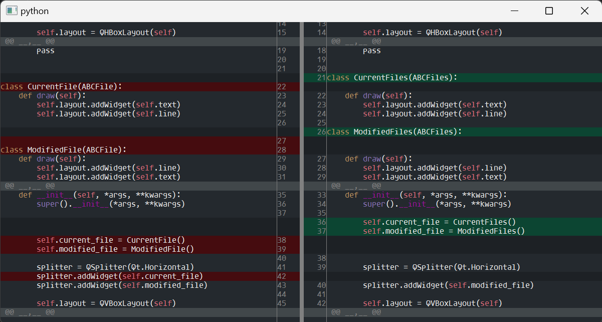

## Описание

Виджет на PySide6 показывающий разницу двух файлов.

Решен в рамках технического задания.

## Запуск.

- Для запуска необходимо установить модуль PySide6 (указан в файле requirements.txt)

- Установить шрифты из папки font

- Отредактируйте именованный кортеж по следующим параметрам.

current_file - Путь до оригинального файла.  
modified_file - Путь до модифицированного/измененного файла.  
sequence_percent - (Не редактировать), нахождение процента разницы в искомых строках, где 1 это 100%.  
backlight - (Не редактировать), подсветка синтаксиса для текущих файлов. Подсветка реализованна только для py файлов.  

- запустите main.py

## Пример того что должно получится

